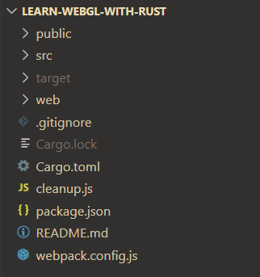
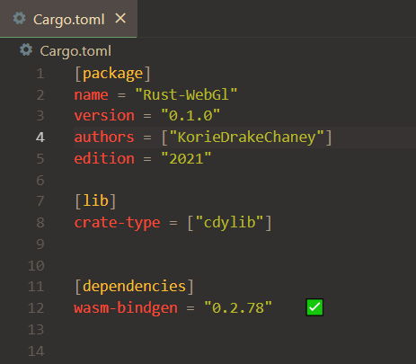
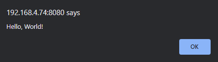

<br>
<h1 style = "text-align: center;"> Chapter 1 : Setup </h1>

--- 
<div style = "background-color : rgba(0, 0, 0, 0.05); text-align: center; ">
<span style="font-size : 30px;"><b>Template</b></span>
</div>

<div style = "padding:2%;background-color : rgba(0, 0, 0, 0.05);">
Before we get into the fun stuff, we do need to set up our dev space.
I'll be using VSCode, but you can use whichever IDE of your choice.

I would also like for you to use the same <a target="_blank" href="https://github.com/KorieDrakeChaney/Rust-Wasm-Web-Template"><b>template</b></a> which I am using, so we do not have any trouble. 
</div>

---

<div style = "background-color : rgba(0, 0, 0, 0.05); text-align: center; ">
<span style="font-size : 30px;"><b><a target ="_blank" href="https://github.com/cargo-generate/cargo-generate">cargo-generate</a></b></span>
<br>
<span style="color:grey">The setup</span>
</div>

``` bash
    cargo generate https://github.com/KorieDrakeChaney/Rust-Wasm-Web-Template.git
```

``` bash
    cd [name-of-your-choice]
    cargo build && npm install
    code ./
```
<div style = "padding:2%;background-color : rgba(0, 0, 0, 0.05);">
You should get something a layout like this :



You'll have a <b style="color:rgba(50, 150, 150, 1);">public</b>, <b style="color:rgba(50, 150, 150, 1);">src</b>, and <b style="color:rgba(50, 150, 150, 1);">web</b> directory. 
</div>

---
<div style = "background-color : rgba(0, 0, 0, 0.05); text-align: center; ">
<span style="font-size : 30px;"><b><a target ="_blank" href="https://github.com/rustwasm/wasm-bindgen">Wasm-Bindgen</a></b></span>
<br>
<span style="color:grey">The communicator</span>
</div>

<div style = "padding:2%;background-color : rgba(0, 0, 0, 0.05);">
You can check into the <b style="color:orange">Cargo.toml</b> file and change the name to whatever you want, I'll fill mine out like this :



You'll notice that there is already a crate-type and a dependency already loaded in. 
Here is one of our ways to talk to javascript, using <a target="_blank" href="https://rustwasm.github.io/wasm-bindgen/">wasm-bindgen</a>. Taken from the <a target="_blank" href="https://github.com/rustwasm/wasm-bindgen">repository</a>:
</div>

<div style = "padding:2%;background-color : rgba(0, 0, 0, 0.05);">
<h2 style="text-align:center"> <b>Features</b> </h2>

* **Lightweight.** Only pay for what you use. `wasm-bindgen` only generates
  bindings and glue for the JavaScript imports you actually use and Rust
  functionality that you export. For example, importing and using the
  `document.querySelector` method doesn't cause `Node.prototype.appendChild` or
  `window.alert` to be included in the bindings as well.

* **ECMAScript modules.** Just import WebAssembly modules the same way you would
  import JavaScript modules. Future compatible with [WebAssembly modules and
  ECMAScript modules integration][wasm-es-modules].

* **Designed with the ["Web IDL bindings" proposal][webidl-bindings] in mind.**
  Eventually, there won't be any JavaScript shims between Rust-generated wasm
  functions and native DOM methods. Because the wasm functions are statically
  type checked, some of those native methods' dynamic type checks should become
  unnecessary, promising to unlock even-faster-than-JavaScript DOM access.
</div>

---

<div style = "background-color : rgba(0, 0, 0, 0.05); text-align: center; ">
<span style="font-size : 30px;"><b><a target ="_blank" href="https://webpack.js.org/">Webpack</a></b></span>
<br>
<span style="color:grey">The bundler</span>
</div>
<div style = "padding:2%;background-color : rgba(0, 0, 0, 0.05);">
In the <b style="color : orange">webpack.config.js</b> file, you'll see that this is our setup:

``` javascript
const CopyPlugin = require("copy-webpack-plugin");
const path = require('path');
const WasmPackPlugin = require("@wasm-tool/wasm-pack-plugin");

module.exports = {
  entry: 
  {
    main : "./web/main.js",
  },
  output: {
    path: path.join(__dirname, 'dist'),
    filename: '[name].js',
  },
  mode: "development",
  plugins: [
    new CopyPlugin({
        patterns: [
          { from: './public/index.html'},
        ],
    }), 
    new WasmPackPlugin({
      crateDirectory: path.resolve(__dirname, ".")
    })
  ],
    experiments : {
        asyncWebAssembly : true
    }

};

```

You do not have to know what's going on here, basically just compiling our code from our rust files into a javascript/wasm relationship.
</div>

<div style = "background-color : rgba(0, 0, 0, 0.05); text-align: center; ">
<span style="font-size : 30px;"><b>Testing</b></span>
<br>
<span style="color:grey">The test</span>
</div>
<div style = "padding:2%;background-color : rgba(0, 0, 0, 0.05);">
To check if we are all on the same page, I want to introduce some of the commands in our <b style="color : orange">package.json</b> file. 

We should have these scripts in our json file

```json 
  "scripts": {
    "build": "node cleanup && webpack",
    "server": "webpack-dev-server",
    "refresh" : "npm run build && npm run server"
  }
```
<b style="color : rgba(50, 135, 61, 1)">"build"</b> : calls node cleanup, which cleans the dist folder, then calls webpack to bundle our code.
<br>
<b style="color : rgba(50, 135, 61, 1)">"server"</b> : creates a <a target="_blank" href="https://webpack.js.org/configuration/dev-server/">webpack-dev-server</a>.
<br>
<b style="color : rgba(50, 135, 61, 1)">"refresh"</b> : calls build then creates a server.

in your terminal, with the folder open, type in the command 

```bash
npm run refresh
```

You should have some new folders created, a <b style="color:rgba(50, 150, 150, 1);">dist</b> folder, and a <b style="color:rgba(50, 150, 150, 1);">pkg</b> folder.

The <b style="color:rgba(50, 150, 150, 1);">pkg</b> folder will contain the files the <b>wasm-pack</b> generated and the <b style="color:rgba(50, 150, 150, 1);">dist</b> will contain files generated by the bundler, <b>webpack</b>.

Open up the dev server that <b>webpack</b> created. You should be greeted with an alert:



Now that we have our environment ready, let's tackle on some WebGL with creating a <a href="./chapter_2.html">window</a>!

</div>

---

Copyright (C) 2022, Korie Chaney.

---

